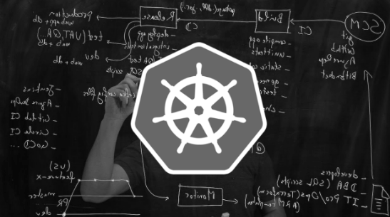

# Workshop Getup

## Kubernetes Administrator

Realizado remotamente,  o treinamento de Container e Kubernetes visa apresentar os conceitos das tecnologias de Container e Kubernetes e seu funcionamento na prática.

### Conteúdo

- Build
  - [Boas práticas com Dockerfile](docker)
- Deploy
  - [Introdução ao Kubernetes](introducao)
  - [Kubernetes Dashboard](ferramentas-auxiliares)
  - [Namespace](namespace)
  - [Pod](pod)
  - [Deployment](deployment)
  - [Service](service)
  - [Resources](resources)
  - [HPA](hpa)
  - [Probes](probes)
  - [Volumes](volumes)
  - [ConfigMap](configmap)
  - [Secrets](secret)
  - [Ingress](ingress)
  - [DaemonSet](daemonset)
  - [StatefulSet](statefulset)
  - [CronJob](cronjob)
  - [Operators](operators)
  - [Kustomize](kustomize)
  - [Flux](flux)

## Kubernetes Developer

O treinamento Kubernetes Developer é focado para times de desenvolvimento do cliente e fábricas de software terceiras. Nele, inicialmente, são apresentados os principais conceitos, componentes e melhores práticas no desenvolvimento de software para rodar em ambientes Kubernetes.

### Conteúdo

- Build
  - [Boas práticas com Dockerfile](docker)
- Deploy
  - [Introdução ao Kubernetes](introducao)
  - [Kubernetes Dashboard](dashboard)
  - [Namespace](namespace)
  - [Pod](pod)
  - [Deployment](deployment)
  - [Service](service)
  - [Resources](resources)
  - [HPA](hpa)
  - [Probes](probes)
  - [Kustomize](kustomize)
  - [Flux](flux)
