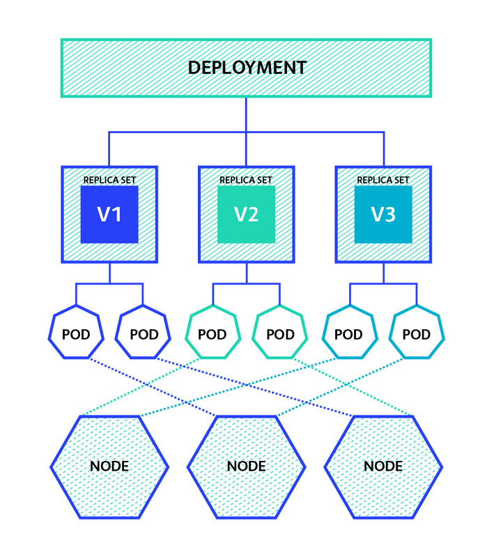

# Deployments, ReplicaSet

## Introdução

Após o contato com os pods, precisamos subir um nível na abstração e apresentar novos objetos que permitem um controle e gestão mais refinado das aplicações. O próximo nível após os pods é o objeto chamado *ReplicaSet*, cuja função é manter um número estabelecido de pods idênticos no cluster. O mecanismo de identificação de quais pods serão geridos pelo ReplicaSet baseia-se no uso de labels aplicados aos pods. Acima desse nível, temos o Deployment, que gerencia os ReplicaSet e entrega um recuros de controle de atualizações. Veja a figura abaixo para visualizar a hierarquia de um deployment:



### Usando Deployments

#### 01 - Deployment básico

Segue um exemplo básico de deployment:

```
apiVersion: apps/v1
kind: Deployment
metadata:
  name: nginx-deployment
  labels:
    app: nginx
spec:
  replicas: 3
  selector:
    matchLabels:
      app: nginx
  template:
    metadata:
      labels:
        app: nginx
    spec:
      containers:
      - name: nginx
        image: nginx:1.14.2
        ports:
        - containerPort: 80
```

Para aplicar no cluster, execute:

```
kubectl apply -f https://k8s.io/examples/controllers/nginx-deployment.yaml
```

Verifique todos os nomes objetos que surgiram no cluster:

```
kubectl get deployment
kubectl get replicaset
kubectl get pods
kubectl describe deployment nginx-deployment
```

Inspecione os objetos `metadata.ownerReferences` do pod e do ReplicaSet criados.

Altere a imagem presente nesse deployment para `nginx:alpine` com o seguinte comando:

```
kubectl edit deploy nginx-deployment

ou

kubectl set image deployment/nginx-deployment nginx=nginx:alpine
```

Após a alteração, veja que novos pods rodam no cluster. Um outro ponto a se notar é que um novo ReplicaSet é criado para contemplar esse novo cenário.

Escale o deployment para cinco réplicas:

```
kubectl scale deployment/nginx-deployment --replicas=5
```
