# DIA 08 - Ingress e Kustomize

## Introdução



### Usando Ingress


Instale o metallb:

```
kubectl edit configmap -n kube-system kube-proxy
```
O campo `strictARP` deve ser alterado para `true`.
```
apiVersion: kubeproxy.config.k8s.io/v1alpha1
kind: KubeProxyConfiguration
mode: "ipvs"
ipvs:
  strictARP: true
```

```
kubectl apply -f https://raw.githubusercontent.com/metallb/metallb/v0.13.4/config/manifests/metallb-native.yaml
```

Aplique o seguinte manifesto no cluster:

```
---
apiVersion: metallb.io/v1beta1
kind: IPAddressPool
metadata:
  name: first-pool
  namespace: metallb-system
spec:
  addresses:
  - 172.18.0.100-172.18.0.200
---
apiVersion: metallb.io/v1beta1
kind: L2Advertisement
metadata:
  name: example
  namespace: metallb-system
spec:
  ipAddressPools:
  - first-pool
```

```
helm repo add ingress-nginx https://kubernetes.github.io/ingress-nginx
```

```
helm repo update
```

```
helm install ingress-nginx ingress-nginx/ingress-nginx -n ingress-nginx --create-namespace
```

```
kubectl create deploy nginx --port=80 --image=nginx:alpine
```

```
kubectl expose deploy/nginx --port=80 --target-port=80
```

```
kubectl create ingress nginx --class=nginx --rule="nginx.marcelo.local/=nginx:80"
```

```
curl http://nginx.marcelo.local
```

### Usando o Kustomize

Kustomize uses a file called `kustomization.yaml` that contains declarative specifications to what resources need to be imported from what manifest files and what changes need to be made. Once it has processed the resources, it emits them to the standard output, which can be stored in a file or directly used with kubectl to apply it to a particular cluster.

One of the excellent use cases of Kustomize is to manage Kubernetes resources for multiple environments. For Kustomize to work in that scenario, you would need a base directory that would contain all manifest files with all the common elements and an overlays directory that contains all the differences for a particular environment.

The following script detects your OS and downloads the appropriate kustomize binary to your current working directory:

```
curl -s "https://raw.githubusercontent.com/kubernetes-sigs/kustomize/master/hack/install_kustomize.sh"  | bash
```

Give the execution permission and move it to yout $PATH:

```
chmod +x kustomize
sudo mv kustomize /usr/local/bin/
```

Test the command:

```
kustomize version
```

#### Example 01

This is basic case with a folder with simple yaml manifests.

Fisrt, generate the kustomization file:

```
kustomize create --autodetect --recursive
```

Kustomize has a subcommand to generate the result manifest with all listed on the kustomization.yaml file:

```
kustomize build .
```

After that, it is possible to apply it with kubectl:

```
kubectl apply -k .
```

#### Example 02

Install basic manifests, a deployment and a service, into two different namespaces, simulating two environments, staging and production.

- Directory Structure

```
├── base
│   ├── deployment.yaml
│   ├── kustomization.yaml
│   └── service.yaml
└── overlays
    ├── production
    │   ├── deployment.yaml
    │   ├── kustomization.yaml
    │   └── namespace.yaml
    └── staging
        ├── deployment.yaml
        ├── kustomization.yaml
        └── namespace.yaml
```

- The Base Configuration

To test the base manifests, run the kustomize build on the base directory. Kustomize emits a manifest yaml that is a combination of the two.

```
kustomize build base
```

- Deploy on Staging

To generate the result manifest to output, run the follow command:

```
kustomize build overlays/staging
```

To apply the manifests, run the follow command:

```
kubectl apply -k overlays/staging
```

- Deploy on Production

To generate the result manifest to output, run the follow command:

```
kustomize build overlays/production
```

To apply the manifests, run the follow command:

```
kubectl apply -k overlays/production
```
