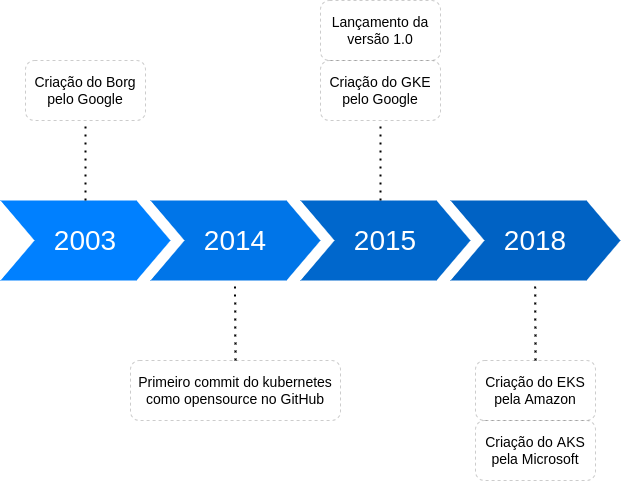
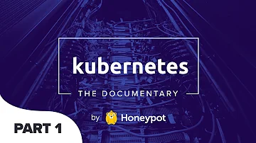
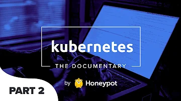
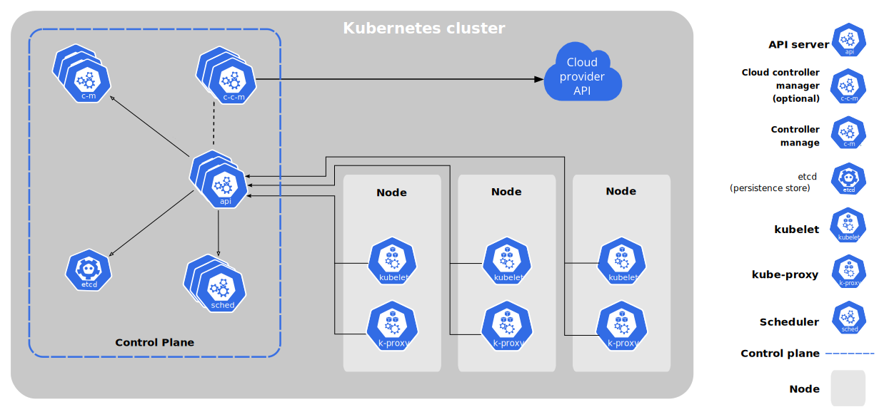

# Introdução ao Kubernetes

O Kubernetes é uma engine de orquestração de contêiners Open Source utlizada para automatizar a implantação, dimensionamento e gerenciamento de aplicações.

## :hourglass: Linha do tempo



- Documentário sugerido contando a história do Kubernetes:

[](https://youtu.be/BE77h7dmoQU)[](https://youtu.be/318elIq37PE)

## Componentes básicos de um cluster

[](https://kubernetes.io/docs/concepts/overview/components/)

## Kubectl

O [kubectl](https://kubernetes.io/docs/tasks/tools/) é um binário criado na linguagem [GO](https://go.dev/) para interagir com a API do cluster.

No decorrer do treinamento serão evidenciados os principais subcomandos do kubectl e seus parâmetros. Abaixo segue a referência para todos os subcomandos e alguns exemplos:

```
https://kubectl.docs.kubernetes.io/references/kubectl/
```

### Tarefa:
- Inspecione os nós do cluster usando o `kubectl`;

### Solução:
- Extraindo informações básicas com o subcomando `get`;

```
kubectl get nodes
```

- Extraindo informações adicionais com o parâmetro `-o wide`;

```
kubectl get nodes -o wide
```

- Visualizar o manifesto usando o parâmetro `-o yaml`;

```
kubectl get nodes <NOME-do-NÓ> -o yaml
```

- Visaulizando informações com o subcomando `describe`:

```
kubectl describe node <NOME-do-NÓ>
```
