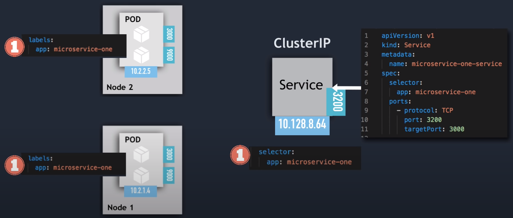

# Services

## Introdução

Service é uma abstração a nível de rede para expor os pods de forma perene, possibilitando o acesso através de um nome e criando um balanceador para distribuir a carga igualmente entre os pods. A definicão de quais pods serão balanceados pelo service se dá através de um selector, que varre os pods que possuem uma determinada label.


### Usando Services

#### 01 - Expondo um pod

```
apiVersion: v1
kind: Pod
metadata:
  name: nginx
  labels:
    app.kubernetes.io/name: proxy
spec:
  containers:
  - name: nginx
    image: nginx:stable
    ports:
      - containerPort: 80
        name: http-web-svc

---
apiVersion: v1
kind: Service
metadata:
  name: nginx-service
spec:
  selector:
    app.kubernetes.io/name: proxy
  ports:
  - name: name-of-service-port
    protocol: TCP
    port: 80
    targetPort: http-web-svc
```

#### 02 - Expondo um deployment - ClusterIP



```
kubectl create deploy nginx --image=nginx:alpine
```

```
kubectl expose deploy/nginx --port=80 --target-port=80 --type=ClusterIP
```

#### 03 - NodePort

Crie um deployment com 2 réplicas:

```
kubectl create deploy nginx --image=nginx:alpine --replicas=2
```

Crie um service do tipo NodePort para esse deploy:

```
kubectl expose deploy/nginx --port=80 --target-port=80 --type=NodePort
```

Identifique o endereço IP de cada nó:

```
kubectl get nodes -o wide
```

Verifique se a conexão com porta alta do service é fechada com sucesso:

```
nc -vz IP PORTA

ou

curl IP:PORTA
```

#### 04 - Port forward a service

```
kubectl create deploy nginx --image=nginx:alpine
```

```
kubectl expose deploy/nginx --port=80 --target-port=80 --type=ClusterIP
```

```
kubectl port-forward --address 0.0.0.0 svc/nginx 8080:80
```

#### 05 - LoadBalancer

Instale o metallb:

```
kubectl apply -f https://raw.githubusercontent.com/metallb/metallb/v0.13.4/config/manifests/metallb-native.yaml
```

Aplique o seguinte manifesto no cluster:

```
---
apiVersion: metallb.io/v1beta1
kind: IPAddressPool
metadata:
  name: first-pool
  namespace: metallb-system
spec:
  addresses:
  - 172.30.0.100-172.30.0.200
---
apiVersion: metallb.io/v1beta1
kind: L2Advertisement
metadata:
  name: example
  namespace: metallb-system
spec:
  ipAddressPools:
  - first-pool
```

Crie um deployment com nginx com um service do tipo LoadBalancer:

```
kubectl create deploy nginx --image=nginx:alpine
```

```
kubectl expose deploy/nginx --port=80 --target-port=80 --type=LoadBalancer
```

#### 06 - Headless

Crie os seguintes recursos no cluster:

```
---
apiVersion: apps/v1
kind: Deployment
metadata:
  name: app
  labels:
    app: server
spec:
  replicas: 3
  selector:
    matchLabels:
      app: web
  template:
    metadata:
      labels:
        app: web
    spec:
      containers:
      - name: nginx
        image: nginx
        ports:
        - containerPort: 80
---
apiVersion: v1
kind: Service
metadata:
  name: regular-service
spec:
  selector:
    app: web
  ports:
    - protocol: TCP
      port: 80
      targetPort: 8080
---
apiVersion: v1
kind: Service
metadata:
  name: headless-svc
spec:
  clusterIP: None
  selector:
    app: web
  ports:
    - protocol: TCP
      port: 80
      targetPort: 8080
```

Rode um pod para avaliar a resolução de DNS em cima de cada service criado:

```
kubectl run -it --rm testedns --image=nicolaka/netshoot
```
